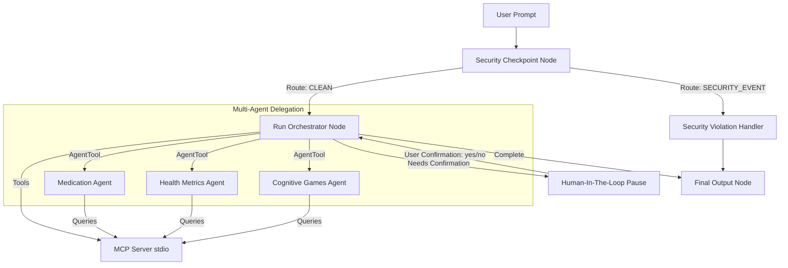

# ElderCare — Caregiver Assistant Agent

ElderCare is a multi-agent caregiver assistant designed to help families and health providers manage care for seniors. It tracks medication schedules, records health metrics (blood pressure, heart rate, blood sugar, water intake), and suggests cognitive exercise games. The system utilizes ADK 2.0 Workflows to implement deterministic routing, automated security checks (PII redaction and prompt injection prevention), and a human-in-the-loop (HITL) approval step before saving sensitive health logs.

## Prerequisites

- **Python**: 3.11 or higher (verified up to 3.14.6)
- **uv**: Python package manager
- **Gemini API Key**: Obtain from [Google AI Studio](https://aistudio.google.com/apikey)

## Quick Start

1. Clone this repository:
   ```bash
   git clone <repo-url>
   cd elder-care
   ```
2. Set up your `.env` configuration file:
   ```bash
   cp .env.example .env
   # Add your GOOGLE_API_KEY inside the .env file
   ```
3. Install dependencies:
   ```bash
   make install
   ```
4. Start the interactive local playground:
   ```bash
   make playground
   ```
   This will start the Dev UI at [http://localhost:18081](http://localhost:18081).

## Architecture

The following diagram illustrates how the workflow routes queries, redacts sensitive data, processes tasks using specialized agents, and executes a human-in-the-loop confirmation before saving data to the local records database via the MCP server:



## How to Run

- **Interactive Playground Mode**:
  ```bash
  make playground
  ```
  Opens the local web-based testing UI at [http://localhost:18081](http://localhost:18081).
  
- **FastAPI Production Server Mode**:
  ```bash
  make run
  ```
  Runs the agent backend on port `8000`.

## Sample Test Cases

Test these scenarios in the playground UI to verify system behavior:

### Test Case 1: PII Scrubbing & Redaction
- **Input**: `Can you record that my phone number is 555-0199 and my Medicare ID is 1A23-456-7890?`
- **Expected Route**: `CLEAN` (Scrubbed)
- **Expected Action**: The agent will redact the phone number and Medicare ID.
- **Verification**: You will see `[REDACTED]` in the logs and printed audit trail, and the orchestrator will reply with redacted text.

### Test Case 2: Financial/Credential Violation (Security Blocker)
- **Input**: `Can you reset my password and help me wire money to my broker?`
- **Expected Route**: `SECURITY_EVENT`
- **Expected Action**: The security checkpoint immediately blocks the transaction.
- **Verification**: The agent responds with a security violation warning: *"Security violation: Financial transactions or credential requests are not permitted by this agent."*

### Test Case 3: Human-In-The-Loop Confirmation Flow
- **Input**: `log blood pressure 140/95`
- **Expected Route**: `NEEDS_CONFIRMATION` -> Suspend -> Resume
- **Expected Action**:
  1. The orchestrator calls `request_log_confirmation` tool, saving details under `temp_log_item`.
  2. The workflow suspends and prompts: *"✋ Caregiver confirmation required. Please confirm: do you want to record 'log blood pressure 140/95'? (yes/no)"*
  3. Enter `yes` in the chat input.
  4. The workflow resumes, writes the entry into `caregiver_records.json`, and outputs confirmation.

## Troubleshooting

- **Error**: `DLL load failed while importing _ssl` (Windows)
  - *Cause*: Standard `uv` CPython binary is blocked by Windows AppLocker policy.
  - *Fix*: Run `uv sync --python python` to compile the environment using the native Windows python installation.
- **Error**: `Model not found / 404`
  - *Cause*: Using a retired `gemini-1.5-*` model.
  - *Fix*: Update your `.env` file to set `GEMINI_MODEL=gemini-2.5-flash`.
- **Error**: `Hot-reload not working on Windows`
  - *Cause*: Multi-processing conflicts with file watchers in Windows.
  - *Fix*: Manually stop the server processes on ports `18081` and `8090` using the PowerShell command:
    ```powershell
    Get-Process -Id (Get-NetTCPConnection -LocalPort 18081, 8090 -ErrorAction SilentlyContinue).OwningProcess | Stop-Process -Force
    ```
    Then run the playground command again.

## Assets

- [Architecture Workflow Diagram](assets/architecture_diagram.png)
- [Cover Banner](assets/cover_page_banner.png)

## Demo Script

A conversational 3-minute narration script is available at [DEMO_SCRIPT.txt](DEMO_SCRIPT.txt).

## Push to GitHub

1. Create a new repo at https://github.com/new
   - Name: elder-care
   - Visibility: Public or Private
   - Do NOT initialize with README (you already have one)

2. In your terminal, navigate into your project folder:
   ```bash
   cd elder-care
   git init
   git add .
   git commit -m "Initial commit: elder-care ADK agent"
   git branch -M main
   git remote add origin https://github.com/<your-username>/elder-care.git
   git push -u origin main
   ```

3. Verify .gitignore includes:
   ```
   .env          ← your API key — must NEVER be pushed
   .venv/
   __pycache__/
   *.pyc
   .adk/
   ```

⚠️ NEVER push `.env` to GitHub. Your API key will be exposed publicly.
