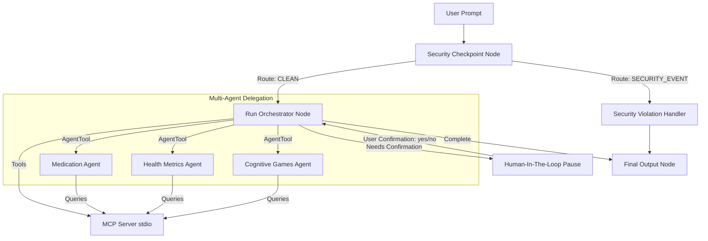

# Submission Write-Up: ElderCare Caregiver Assistant Agent

## Problem Statement
Caring for senior family members with chronic medical conditions or cognitive impairments is a demanding task for caregivers. Tracking medication intake daily, recording health metrics accurately, and keeping the senior mentally engaged requires constant attention. Caregivers need a reliable, secure assistant that simplifies record-keeping, warns them of irregular health readings, and ensures data is handled securely without risking personal identifiable information (PII) exposure.

## Solution Architecture
The system utilizes a directed graph workflow model to coordinate security screening, multi-agent reasoning, and caregiver log verification:

## Concepts Used & File References
- **ADK Workflow**: Coordinates deterministic routing of queries.
  - *Reference*: Defined in [elder_care/agent.py](file:///c:/Users/Gigi%20Mathew/Documents/projects/gxm_adm_workspace/elder-care/elder_care/agent.py#L264) using `Workflow` and `START`.
- **LlmAgent**: Specialist agents for reasoning tasks.
  - *Reference*: Defined in [elder_care/agent.py](file:///c:/Users/Gigi%20Mathew/Documents/projects/gxm_adm_workspace/elder-care/elder_care/agent.py#L47-L112) (`medication_agent`, `health_metrics_agent`, `cognitive_games_agent`, and `orchestrator_agent`).
- **AgentTool**: Delegates tasks from orchestrator to sub-agents.
  - *Reference*: Used in [elder_care/agent.py](file:///c:/Users/Gigi%20Mathew/Documents/projects/gxm_adm_workspace/elder-care/elder_care/agent.py#L106-L111) inside `orchestrator_agent`.
- **MCP Server**: Local standard model context protocol server managing logs.
  - *Reference*: Implemented in [elder_care/mcp_server.py](file:///c:/Users/Gigi%20Mathew/Documents/projects/gxm_adm_workspace/elder-care/elder_care/mcp_server.py).
- **Security Checkpoint**: Intercepts queries, redacts PII, blocks injection attempts, and writes structured audits.
  - *Reference*: Function node `security_checkpoint` in [elder_care/agent.py](file:///c:/Users/Gigi%20Mathew/Documents/projects/gxm_adm_workspace/elder-care/elder_care/agent.py#L137).
- **Agents CLI**: Project lifecycle management, template scaffolding, local environment synchronization, and dev playground.
  - *Reference*: Verified in [pyproject.toml](file:///c:/Users/Gigi%20Mathew/Documents/projects/gxm_adm_workspace/elder-care/pyproject.toml) and [Makefile](file:///c:/Users/Gigi%20Mathew/Documents/projects/gxm_adm_workspace/elder-care/Makefile).

## Security Design
- **PII Scrubbing**: Patient records (phone numbers, Social Security Numbers, Medicare ID cards) are detected via regular expressions and replaced with `[REDACTED]`. This prevents private data from leaking to external LLM providers.
- **Prompt Injection Prevention**: Detects hostile prompt directives (e.g. "ignore previous instruction") and immediately redirects control to `security_violation_handler`.
- **Financial Blockers**: Keywords like "wire money" are flagged as out-of-scope for elder care, preventing financial fraud or unauthorized transactions.
- **Audit Logs**: All decisions, redactions, and blocked attempts write structured JSON entries to `security_audit.json`.

## MCP Server Design
The local Model Context Protocol server manages a structured caregiver registry (`caregiver_records.json`):
1. `get_medication_schedule`: Exposes current prescriptions, times, and dosages.
2. `log_medication_intake`: Logs details of when a pill is taken or skipped.
3. `log_health_metric`: Logs patient stats (BP, HR, blood sugar, water) and flags abnormal readings.
4. `get_health_metrics_history`: Exposes past patient logs for trends.
5. `get_cognitive_games`: Exposes catalog of mental exercises.

## Human-In-The-Loop (HITL) Flow
To prevent accidental or incorrect medical logging, the agent requires caregiver confirmation. When an intake or metric log is submitted, the orchestrator triggers the `request_log_confirmation` tool, saving details in `ctx.state` and returning a `RequestInput` event. The workflow suspends, displays a confirmation dialog, and resumes only after the caregiver reviews and inputs `yes` or `no`.

## Demo Walkthrough
1. **PII Redaction**: A caregiver enters a phone number or Medicare Card ID. The system prints a structured audit log and redacts the query.
2. **Security Violation**: Caregiver prompts the agent to "wire money to my bank". The workflow intercepts the phrase and returns an access denied error.
3. **Medication & Logging Flow**: Caregiver asks to log medication. The system requests confirmation, accepts a `yes` prompt, and updates `caregiver_records.json` permanently.

## Impact & Value
ElderCare reduces cognitive burden on caregivers by organizing logs in one place, providing an engaging activity catalog for seniors, and protecting sensitive patient identifiers. By keeping medical logs locked locally behind an MCP server and requiring explicit human approvals, it ensures high compliance and security.
